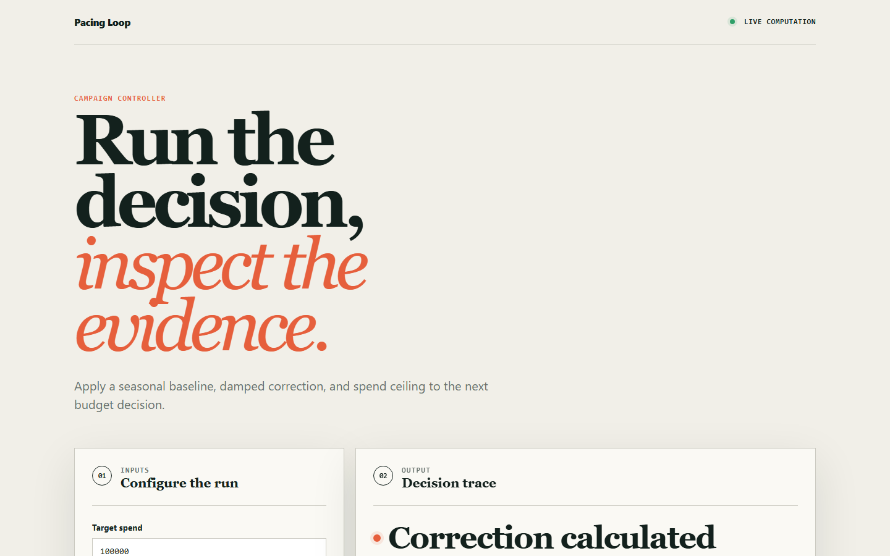
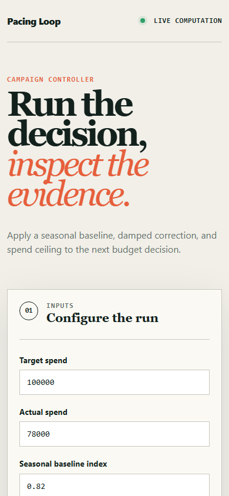

# pacingloop

> Real-time campaign pacing with robust seasonal baselines and a damped controller - so it never fires on a normal Saturday.

## Live deployment

[](https://github.com/SlateGitOrg/pacingloop/actions/workflows/ci.yml)

[Open the working Pacing Loop application](https://slategitorg.github.io/pacingloop/)

This deployed application runs the project's decision workflow in the browser. Change the inputs, run the analysis, and inspect the computed metrics and decision trace.

### Desktop



### Mobile



`FLAGSHIP` · **Marketing Analyst** · Advanced · ~4-5 weeks · Gaming - user acquisition for a live mobile title

**Primary language:** TypeScript
**Tags:** `streaming`, `anomaly-detection`, `control-systems`, `redis`, `timescaledb`, `event-driven`

---

## The problem

A misconfigured bid or a broken creative can burn a week's budget in four hours, overnight, on a Saturday. By Monday the money is gone. The mirror failure is quieter: a campaign under-pacing all month means the budget expires unspent, which nobody treats as an incident despite being the same size of loss.

## ⭐ The differentiator

Anomaly detection uses a **robust seasonal baseline - hour-of-week median plus MAD** - and pacing uses a **damped control loop with explicit guardrails and a rate limiter**. A naive proportional controller chasing a noisy spend signal oscillates, over-corrects, and destabilises delivery worse than doing nothing at all. And a mean-plus-three-sigma threshold fires every Saturday evening, gets muted within a week, and then misses the real incident - which is the actual, observable failure mode of most alerting.

This is the sentence to lead with when someone asks you to walk through the
project. Everything else in this repo exists to make it true and to prove it.

## Data

A documented synthetic event stream - impressions, clicks, installs, spend at second granularity with hour-of-week seasonality - plus **planted incidents at known times** (bid runaway, creative breakage, tracking outage, fraud spike) so detection latency *and* false-alarm rate are both measured.

> No paid API key is required to run or demo this project. Where a paid
> service would add value it is wired as an optional enhancement behind an
> interface with an offline mock as the default implementation.

## Stack

- TypeScript, Node
- Redis Streams for ingest; TimescaleDB for history
- React operations dashboard
- Docker, Vitest

## Core capabilities

- Streaming ingestion with windowed aggregation and explicit late-event handling
- Robust seasonal baselines (hour-of-week median + MAD) per campaign and per creative
- Multi-signal anomaly scoring that distinguishes a tracking outage from a genuine performance change
- Damped pacing controller with hard spend ceilings, rate limits, and an audited manual override
- Incident timeline replaying the exact signals available at decision time

## Repository layout

```
src/ingest/
src/baseline/
src/control/
apps/web/
sim/incidents/
test/
```

## Build plan

1. Generator with hour-of-week seasonality and planted incidents. Seasonality is the thing that breaks naive detectors, so build it in deliberately.
2. Robust baselines, then measure false alarms across twelve simulated weeks before adding any control logic.
3. Controller with damping. Tune it in simulation; an oscillating controller in production is worse than manual.
4. Dashboard and incident replay last.

## Testing strategy

Assert detection of **every planted incident within a stated latency budget**. Assert **zero alerts fire on ordinary weekend seasonality across twelve simulated weeks** - the assertion that separates an alert somebody trusts from one they mute. Assert the controller converges without oscillation under noisy input.

Tests assert **correctness**, not merely that the code runs. A green suite on
this repo is a claim about behaviour under adversarial conditions; treat any
test that would pass against a deliberately broken implementation as a bug in
the test.

## Quality & safety layer

Hard spend ceilings are enforced independently of the controller, so a controller bug cannot overspend. Every automated action is logged with the signals that justified it and is manually reversible.

## Measurable outcome

> Bid-runaway incidents are caught in a median four minutes instead of fourteen hours, at a false-alarm rate of 0.3 per week - low enough that nobody mutes it.

State it in these terms — business units, not technical ones — in your CV
bullet and in the first thirty seconds of describing the project.

## Interview questions this project answers

- **Why does mean plus three sigma fail on seasonal data?**
- **How do you stop a control loop oscillating?**
- **How do you tell a tracking outage apart from a real performance drop?**

## What this deliberately is *not*

- Not a bidding engine. It observes and paces; the platform bids.
- Not an ML anomaly detector - robust statistics are the right tool here and the README argues why.


## Run it now

```bash
npm test        # runs the suite; no install step needed
npm run demo    # the 60-second artefact
```

Requires Node 22.6+ (24 recommended). TypeScript runs natively via
type stripping - there is no build step and no `node_modules`.

## Getting started

```bash
git clone <your-fork-url> pacingloop
cd pacingloop
docker compose up -d
npm install
npm run sim                   # seasonal stream + planted incidents
npm run dev
npm run test                  # detection latency + zero weekend false alarms
```

Docker is supported but optional — every path above works on a plain
Windows/macOS/Linux laptop without a cloud account.

## Definition of done

- [ ] The differentiator above is implemented, and a test proves it
- [ ] The measurable outcome is produced by a command anyone can run
- [ ] `README` explains the one decision a generic version gets wrong
- [ ] CI runs the full suite on every push and is green on `main`
- [ ] A recruiter can see the headline artefact in under 60 seconds

## Licence

MIT — see [LICENSE](LICENSE).
